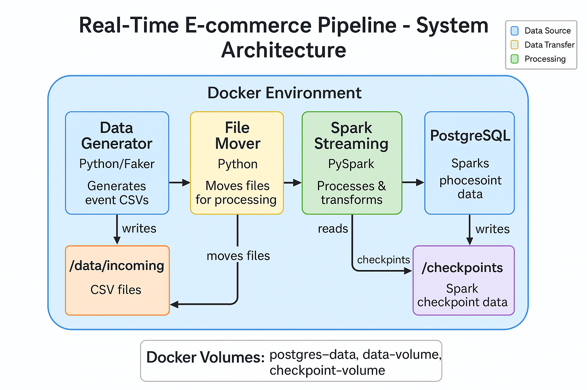

# Real-Time E-Commerce Data Pipeline

A scalable, containerized data pipeline for processing e-commerce events in real-time using Apache Spark Structured Streaming and PostgreSQL.



## 📋 Overview

This project implements a complete end-to-end data pipeline for processing e-commerce user interaction events in real-time. The system generates realistic e-commerce event data (product views, purchases, searches, etc.), processes it through Apache Spark Structured Streaming, and stores the results in PostgreSQL for analysis.

### Key Features

- **Real-time event processing**: Process e-commerce events as they occur
- **Scalable architecture**: Built with Docker containers for easy scaling
- **Fault-tolerant**: Includes error handling, checkpointing, and retry mechanisms
- **End-to-end pipeline**: From data generation to storage and analysis
- **Configurable**: All settings managed through environment variables

## 🏗️ Architecture

The pipeline consists of the following components:

1. **Data Generator**: Creates realistic e-commerce events and writes them to CSV files
2. **File Mover**: Transfers files from the incoming directory to the processing directory
3. **Spark Streaming**: Processes the CSV files using Spark Structured Streaming
4. **PostgreSQL Database**: Stores the processed events for analysis

## 🚀 Getting Started

### Prerequisites

- [Docker](https://www.docker.com/get-started) and Docker Compose
- Git

### Installation

1. Clone the repository:
   ```bash
   git clone https://github.com/yourusername/real-time-ecommerce-pipeline.git
   cd real-time-ecommerce-pipeline
   ```

2. Create a `.env` file based on the example (or use the existing one):
   ```bash
   POSTGRES_HOST=postgres
   POSTGRES_PORT=5432
   POSTGRES_DB=ecommerce
   POSTGRES_USER=postgres
   POSTGRES_PASSWORD=postgres
   PROCESSING_PATH=/data/processing
   CHECKPOINT_PATH=/checkpoints
   ```

3. Start the services:
   ```bash
   docker-compose up -d
   ```

4. Verify the services are running:
   ```bash
   docker-compose ps
   ```

## 📊 Data Flow

1. **Data Generation**: The data-generator service creates fake e-commerce events and saves them as CSV files in `/data/incoming`
2. **File Movement**: The file-mover service moves files from `/data/incoming` to `/data/processing`
3. **Data Processing**: Spark Structured Streaming processes the files in `/data/processing`
4. **Data Storage**: Processed events are stored in the PostgreSQL database in the `events` table

## 📁 Project Structure

```
real-time-ecommerce-pipeline/
├── data/                  # Shared data directory for CSV files
├── docs/                  # Project documentation
├── generator/             # Event data generator
│   └── data_generator.py  # Script to generate e-commerce events
├── postgres/              # PostgreSQL setup
│   └── postgres_setup.sql # Database initialization script
├── spark/                 # Spark streaming code
│   ├── file_mover.py      # Script to move files for processing
│   └── spark_streaming_to_postgres.py  # Spark streaming job
├── .env                   # Environment variables
├── docker-compose.yml     # Docker Compose configuration
└── Dockerfile             # Multi-stage Dockerfile for services
```

## 🔍 Monitoring and Inspection

### Viewing Logs

```bash
# View logs from all services
docker-compose logs

# View logs from a specific service
docker-compose logs spark-streaming
```

### Accessing PostgreSQL

```bash
# Connect to PostgreSQL database
docker exec -it ecommerce-postgres psql -U postgres -d ecommerce

# Run a query
SELECT event_type, COUNT(*) FROM events GROUP BY event_type;
```

## 🔧 Configuration

### Modifying Event Generation

To adjust the event generation rate and batch size, modify the `command` parameters in the `docker-compose.yml` file:

```yaml
command: ["python", "/generator/data_generator.py", "--output-dir", "/data/incoming", "--interval", "5", "--batch-size", "10"]
```

### Scaling Services

You can scale individual services by modifying the Docker Compose configuration or using the `--scale` option:

```bash
docker-compose up -d --scale data-generator=2
```

## 🔄 Development

### Adding New Event Types

To add new event types, modify the `EVENT_TYPES` list in `generator/data_generator.py` and update the corresponding transformation logic in `spark/spark_streaming_to_postgres.py`.

### Extending the Schema

If you need to add new fields to the events:

1. Update the CSV header and event generation in `generator/data_generator.py`
2. Update the schema definition in `spark/spark_streaming_to_postgres.py`
3. Modify the PostgreSQL table schema in `postgres/postgres_setup.sql`

## 📚 Additional Resources

- [Project Overview](docs/project_overview.md)
- [Performance Metrics](docs/performance_metrics.md)
- [User Guide](docs/user_guide.md)
- [Test Cases](docs/test_cases.md)

## 🛠️ Troubleshooting

### Common Issues

**Files not being processed by Spark:**
- Check if the file-mover service is running
- Verify file permissions in the data volume
- Check Spark logs for errors

**Postgres connection issues:**
- Ensure the PostgreSQL container is healthy
- Verify the database credentials in `.env`
- Check network connectivity between containers


